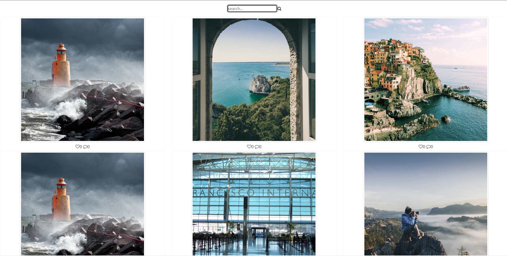

<h1 align="center">Alurapic - A pic's project 📷</h1>

<p align="center">
 <a href="#description">Description</a> •
 <a href="#features">Features</a> • 
 <a href="#requirements">Requirements</a> • 
 <a href="#author">Author</a>
</p>

<h4 align="center"> 
	✅  Angular App 🚀 construction...  ✅
</h4>

<p align="center">
    
</p>

💻 Description
=======================
<p align="center">A basic project where you can find some photos 📷</p>

<a href="https://angular.io/" target="_blank">
    
</a>

<a href="https://www.typescriptlang.org/" target="_blank">
    
</a>

<a href="https://developer.mozilla.org/pt-BR/docs/Learn/Getting_started_with_the_web/HTML_basics" target="_blank">
    
</a>

<a href="https://developer.mozilla.org/pt-BR/docs/Web/CSS" target="_blank">
    
</a>

<a href="https://nodejs.org/en" target="_blank">
    
</a>

<a href="https://www.npmjs.com/" target="_blank">
    
</a>
<p></p>

:zap: Obs
=======================
- The only working route is: /user/flavio

🚀 Features
=======================
- [x] List photos by user
- [x] Filter photos

📑 Requirements
=======================
Before starting, you must have installed the following tools on your machine: [GIT](https://git-scm.com/downloads), [ANGULAR](https://angular.io/guide/setup-local) and [NODE](https://nodejs.org/en) with [NPM](https://www.npmjs.com/). Also it's nice to have an editor to work with the code like [VSCode](https://code.visualstudio.com/).

```bash
# Clone this repository
$ git clone https://github.com/J-Neto/aluraPic.git

# Access project's folder in terminal/cmd
$ cd alurapic

# Open the code in the editor
$ code .
or manually open via file explorer by mouse right clicking or by VSCode on the path "File > Open Folder > [Find the folder "alurapic"] > Open"

# Download node modules
$ npm i

# Run app's
$ ng serve

# Open another terminal and access backend page
$ cd api

# Download backend node modules
$ npm i

# Run server
$ npm start
```

😎 Author
=======================
<a href="https://https://github.com/J-Neto"><br><p><b>José Neto</b> 👽</p></a><br>

Made with ❤️ by José Neto 👋🏽 Get in touch!

<a href="https://www.linkedin.com/in/jos%C3%A9-neto-299920152/"> </a> 
<a href="mailto:ribeirojoseph44@gmail.com"> </a> 
<a href="https://www.instagram.com/neto._ribeiro/"> </a>